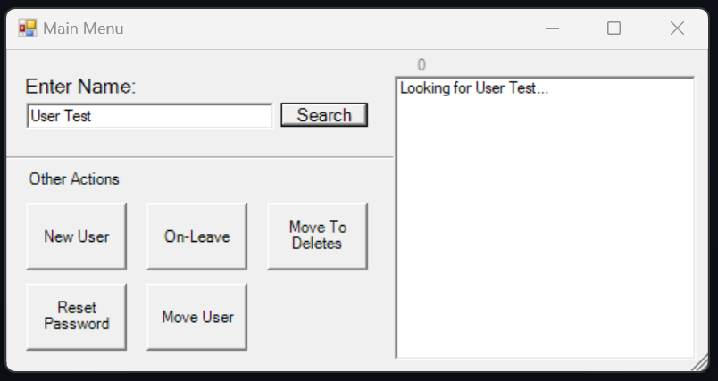
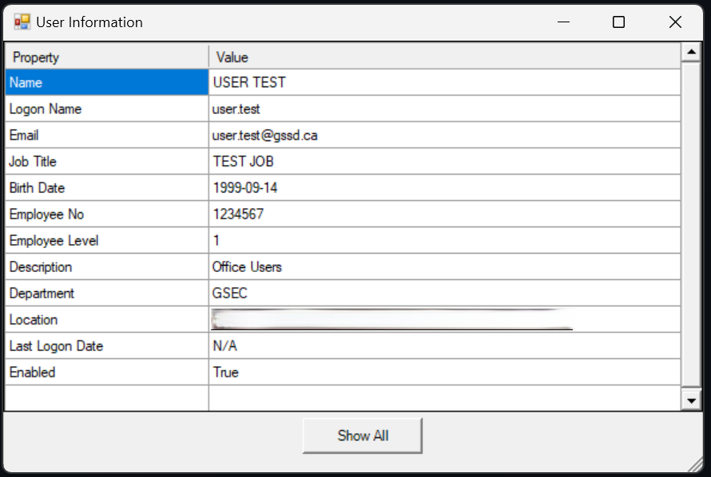
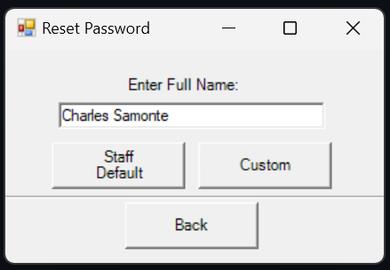
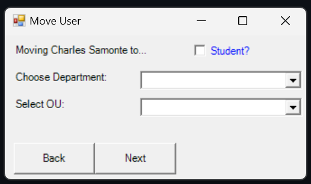

# 🔐 QuickAD

**QuickAD** is a simple, interactive GUI tool built with PowerShell to speed up day-to-day Active Directory user management tasks. Designed for IT admins and support staff, it lets you perform common AD operations quickly without diving into the AD console or writing commands manually.

---

## ✨ Features

QuickAD currently supports:

- 🔍 **View user details** by entering a username or full name
- 🔄 **Reset user passwords** to a default or custom value
- 🗃️ **Move users to a different Organizational Unit (OU)**
- 🧑‍🤝‍🧑 **List users** with similar names (for easy identification)
- ✏️ **Modify user attributes**, such as basic profile fields
- ❌ **Delete users** (either permanently or move to a "Deleted" OU for safety)

---

## 🖥️ How It Works

QuickAD is an **interactive PowerShell GUI** with pre-defined functions. Once launched, you can enter user details and perform tasks through buttons and input fields.

---

## ⚙️ Requirements

- ✅ Windows 10 or 11
- ✅ Access to Active Directory (requires RSAT or AD module installed)
- ✅ AD credentials with permission to view/modify user objects

---

## 🚀 Getting Started

### 🔧 Option 1: Run the Script Directly

1. Download `QuickAD.ps1` from this repository.
2. Right-click and select **Run with PowerShell**.
3. If prompted, sign in with an authorized AD credential.

### 🖱️ Option 2: Use the Shortcut

1. Download or clone this repository.
2. Copy the included **QuickAD shortcut** to your desktop.
3. Double-click the shortcut to launch the app quickly.

---

## 💡 Usage Example

- Need to verify a user's **Date of Birth** or department quickly? Just type their name, hit enter, and view their details.
- User forgot their password? Use QuickAD to **reset it to your company’s default**, or set a custom password on the fly.
- Want to reorganize users into different departments? Move them between **OUs** in a few clicks.

---

## 🖼️ Screenshots

> _Make sure your images are saved in an `images/` folder in your repo. Replace the filenames if needed._

### 🔐 Main Interface

### 🔍 User Details Example

### 🔄 Reset Password Function

### 🗃️ Move User to OU

---

## 🛡️ Security & Error Handling

- You may be prompted to sign in with AD credentials when opening the app.
- All errors are displayed interactively within the app—no hidden failures.
- Currently, there is **no persistent logging**, but errors are shown in real-time.

---

## 📝 License & Attribution

This project is open and free to use or modify.

You're welcome to customize and redistribute QuickAD for your own needs.  
If you find it helpful, a small mention or credit would be appreciated. 🤝

---

## 📂 File Info

- `QuickAD.ps1` – The full, self-contained PowerShell GUI script

---

## 📫 Contact

Have suggestions, issues, or want to contribute?  
Feel free to open an [Issue](https://github.com/your-repo/issues) or submit a pull request.

---

## 🙌 Thanks for using QuickAD!
